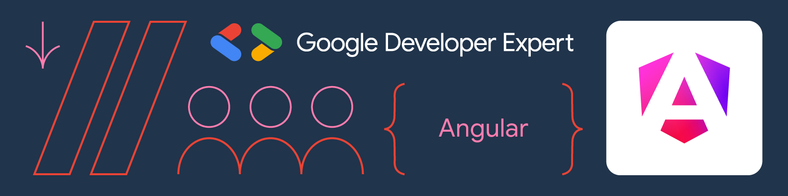

# Hi there, I'm Davide Passafaro 👋

### Senior Frontend Engineer & Google Developer Expert in Angular

&nbsp;
&nbsp;

 
 

I am a **Senior Frontend Engineer** and **GDE in Angular** with a passion for architecting scalable, high-performance applications.  
Currently leading developer communities at **GDG Roma Città** and **Angular Roma**.

While my core expertise lies in the **Angular ecosystem**, I am actively expanding my architectural horizons into **Node.js** and **React** to build comprehensive full-stack solutions.

 

---

 

## 🛠️ Technical Arsenal

<table align="center">
  <tr>
    <td align="center" width="96">
      
       Angular
    </td>
    <td align="center" width="96">
      
       RxJS
    </td>
    <td align="center" width="96">
      
       NgRx
    </td>
    <td align="center" width="96"></td>
    <td align="center" width="96">
      
       Node.js
    </td>
     <td align="center" width="96">
      
       Express.js
    </td>
    <td align="center" width="96">
      
       React
    </td>
  </tr>
</table>

<table align="center">
  <tr>
    <td align="center" width="96">
      
       Git
    </td>
    <td align="center" width="96">
      
       TypeScript
    </td>
    <td align="center" width="96">
      
       JavaScript
    </td>
    <td align="center" width="96">
      
       HTML5
    </td>
    <td align="center" width="96">
      
       CSS3
    </td>
    <td align="center" width="96">
      
       Sass
    </td>
    <td align="center" width="96">
      
       Docker
    </td>
  </tr>
</table>

<table align="center">
  <tr>
    <td align="center" width="96">
      
       Capacitor
    </td>
    <td align="center" width="96">
      
       Electron
    </td>
    <td align="center" width="48"></td>
    <td align="center" width="96">
      
       Ionic
    </td>
    <td align="center" width="96">
      
       Storybook
    </td>
    <td align="center" width="48"></td>
    <td align="center" width="96">
      
       Jest
    </td>
    <td align="center" width="96">
      
       Cypress
    </td>
  </tr>
</table>

---

<!-- <table align="center">
  <tr>
    <td align="center" width="96">
      
       Nx
    </td>
    <td align="center" width="96">
      
       Vite
    </td>
    <td align="center" width="96">
      
       Cordova
    </td>
    <td align="center" width="48"></td>
    <td align="center" width="96">
      
       Ionic
    </td>
    <td align="center" width="96">
      
       Stencil.js
    </td>
    <td align="center" width="48"></td>
    <td align="center" width="96">
      
       TipTap
    </td>
    <td align="center" width="96">
      
       ChartJs
    </td>
    <td align="center" width="96">
      
       Bootstrap
    </td>
  </tr>
</table>

--- -->

 

## ✍️ Latest Stories on Medium

<!-- BLOG-POST-LIST:START -->
<!-- BLOG-POST-LIST:END -->

 

---

