

  
## Hi, I'm Davide Passafaro, nice to meet you 👋

[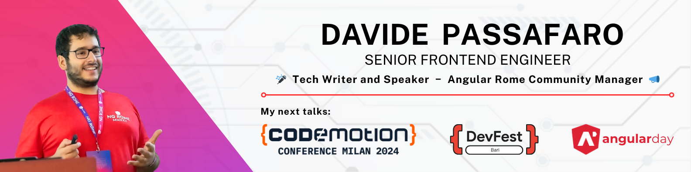](https://medium.com/@davidepassafaro)

As a Senior Frontend Engineer, I lead two developer communities in Rome: GDG Roma Città and Angular Roma. 
I am passionate about contributing to the tech community as a writer and speaker.

Specializing in Angular, I also have extensive experience in mobile and desktop app development using Capacitor and Electron. 
Over the years, I’ve built high-performing applications leveraging technologies like Nx, NgRx, and NGXS.  

Outside of work, I love playing board games or practicing archery. I’m also a fan of escape rooms and enjoy creating funny memes.

### Connect with me:

&nbsp;&nbsp;&nbsp;&nbsp;
[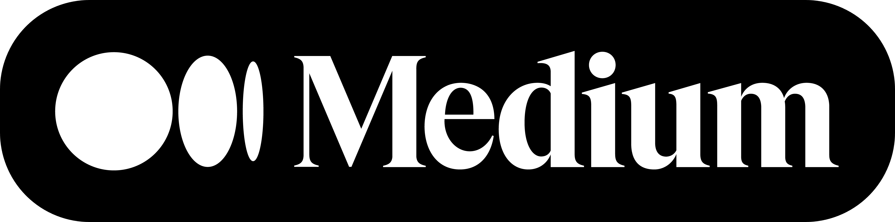](https://medium.com/@davidepassafaro)

<!--  -->

### Read my latest Medium articles:

<!--  -->

[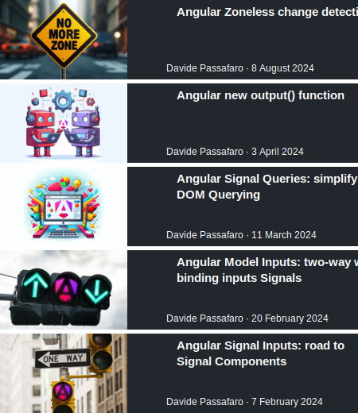](https://medium.com/@davidepassafaro)

### My conference sessions in 2024:

[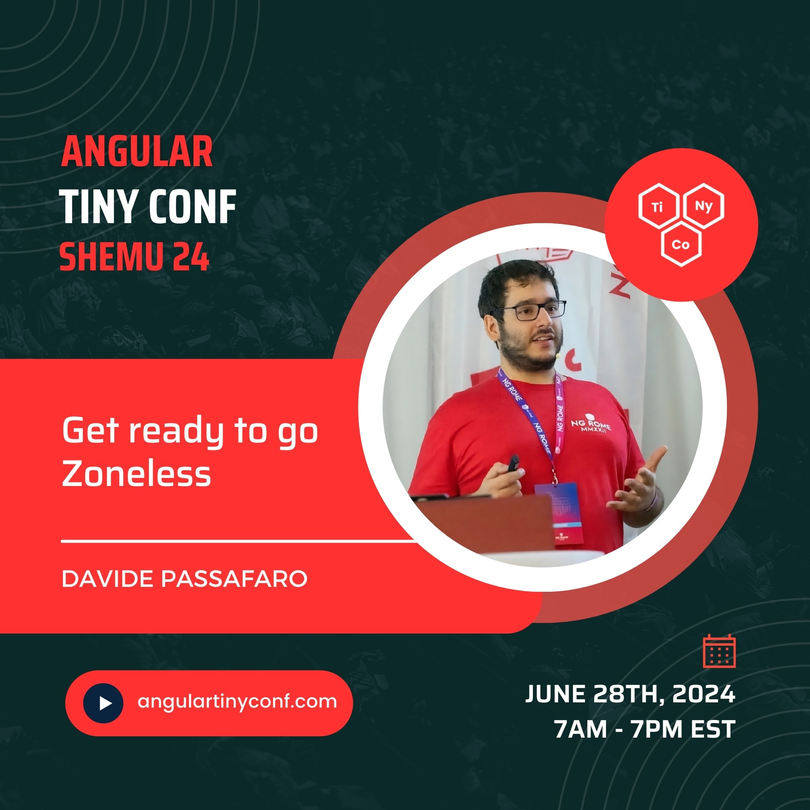](https://www.youtube.com/live/nVcerb1tOUA?si=cww0p0AzzMvvPw8U&t=16239)
&nbsp;&nbsp;&nbsp;&nbsp;
[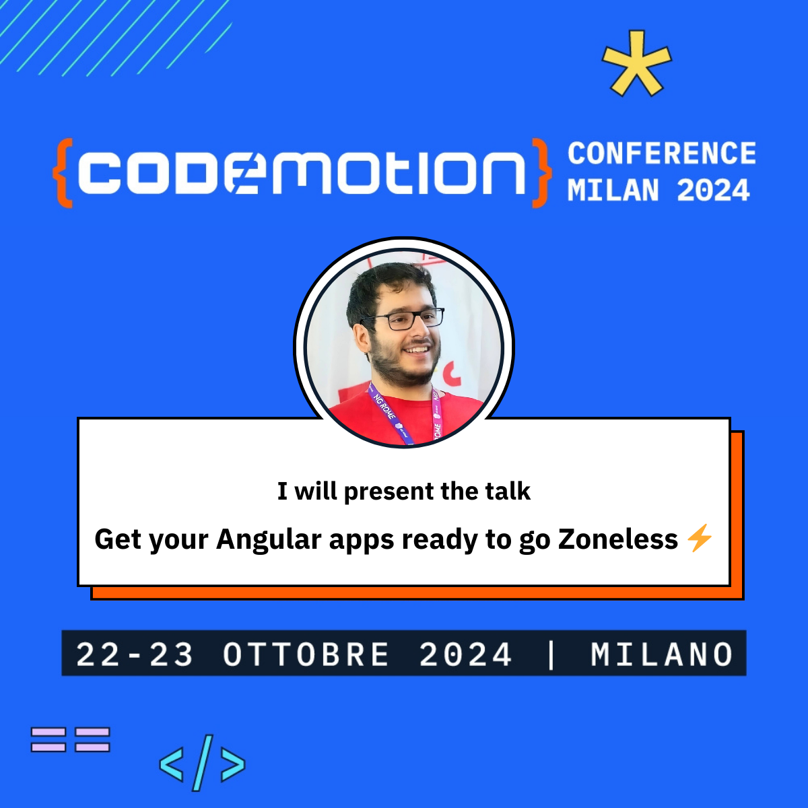](https://conferences.codemotion.com/milan2024)
&nbsp;&nbsp;&nbsp;&nbsp;

&nbsp;&nbsp;&nbsp;&nbsp;

[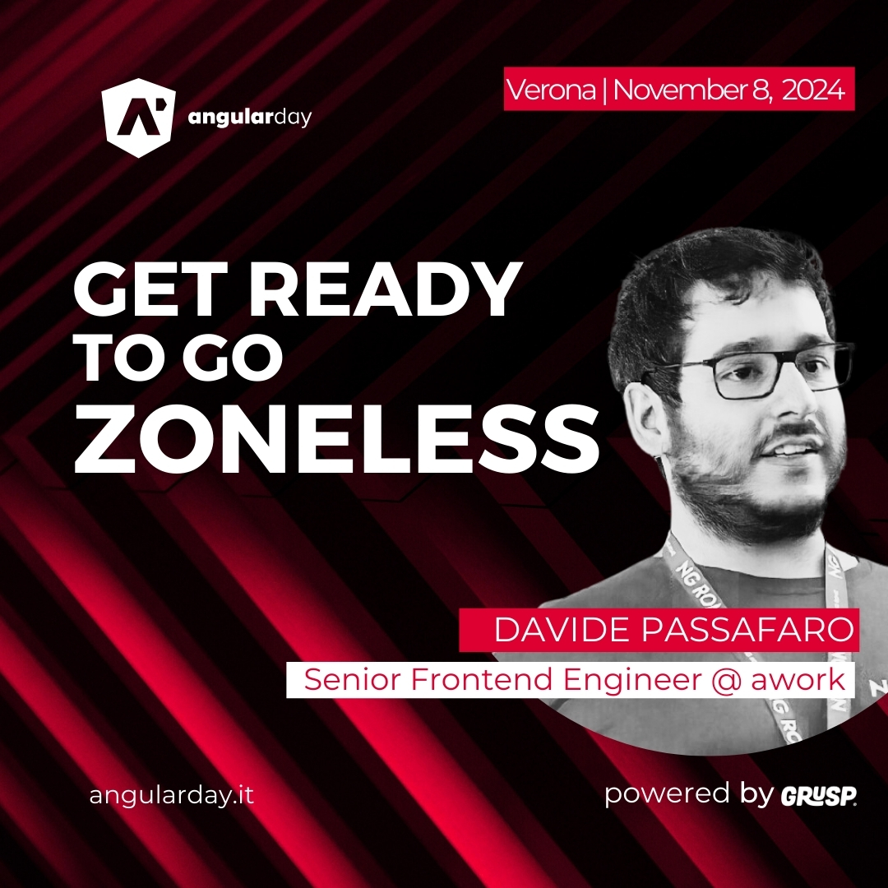](https://2024.angularday.it/talks_speakers/#davide-passafaro)
&nbsp;&nbsp;&nbsp;&nbsp;
[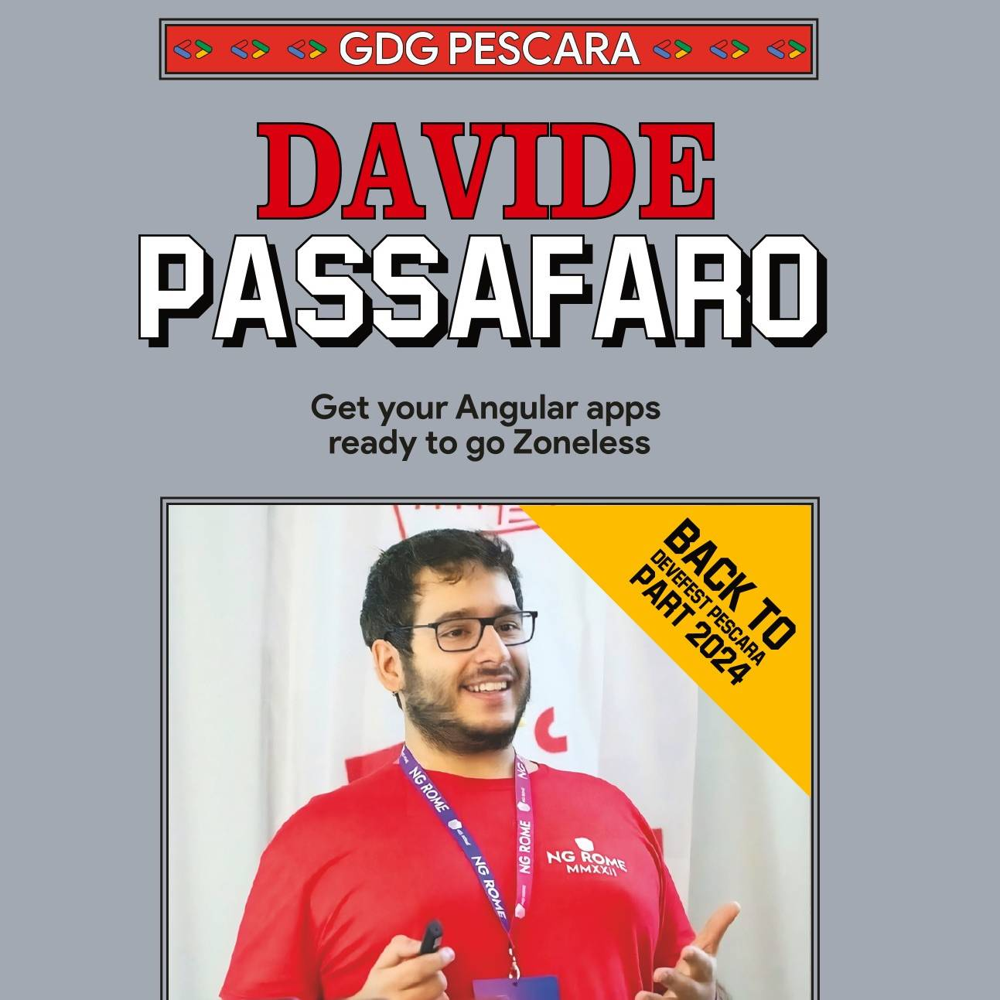](https://gdg.community.dev/events/details/google-gdg-pescara-presents-back-to-devfest-pescara-part-2024)
&nbsp;&nbsp;&nbsp;&nbsp;
[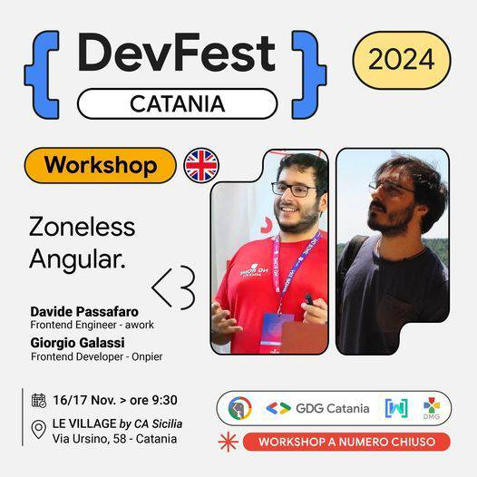](https://gdg.community.dev/events/details/google-gdg-catania-presents-devfest-catania-2024-revolution-ai/)

---

### Languages, frameworks and tools I work with:

[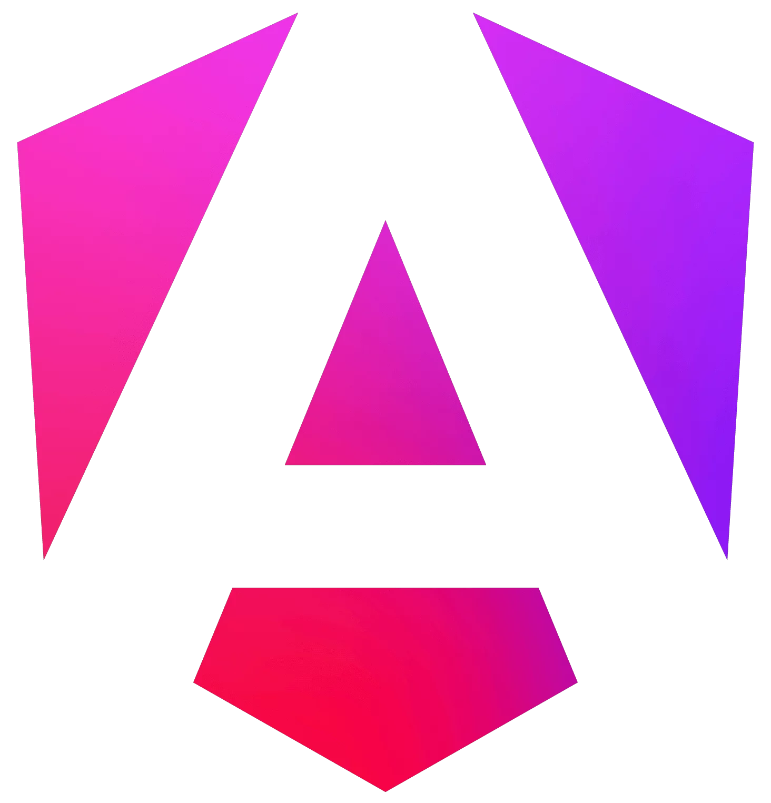](https://angular.io)

[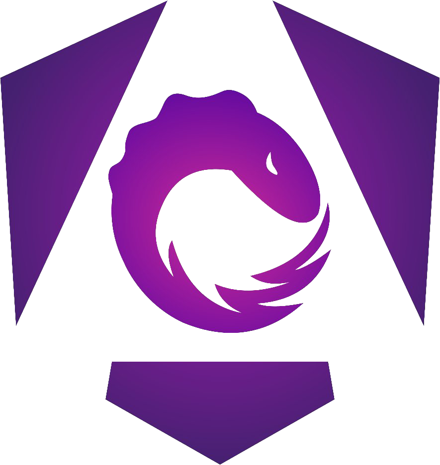](https://ngrx.io)
&nbsp;&nbsp;&nbsp;&nbsp;

&nbsp;&nbsp;&nbsp;&nbsp;

[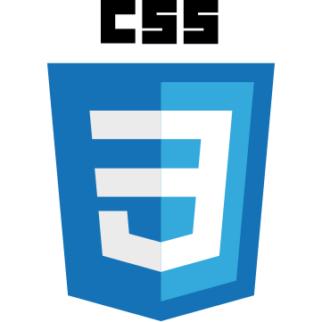](https://www.w3schools.com/css)
&nbsp;&nbsp;&nbsp;&nbsp;

### Other technologies I worked with:

&nbsp;&nbsp;&nbsp;&nbsp;

[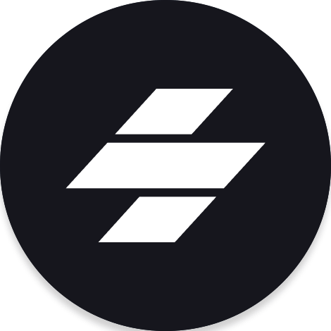](https://stenciljs.com)
&nbsp;&nbsp;&nbsp;&nbsp;

[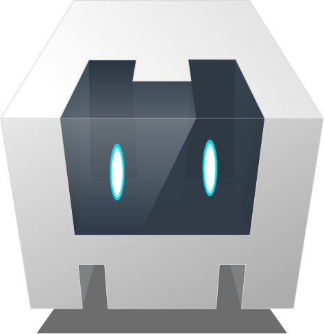](https://cordova.apache.org)
&nbsp;&nbsp;&nbsp;&nbsp;

&nbsp;&nbsp;&nbsp;&nbsp;

---

### GitHub stats:

| My Github Stats                                                                                                                    | Most Used Languages                                                                                                                                          |
| ---------------------------------------------------------------------------------------------------------------------------------- | ------------------------------------------------------------------------------------------------------------------------------------------------------------ |
|  |  |

