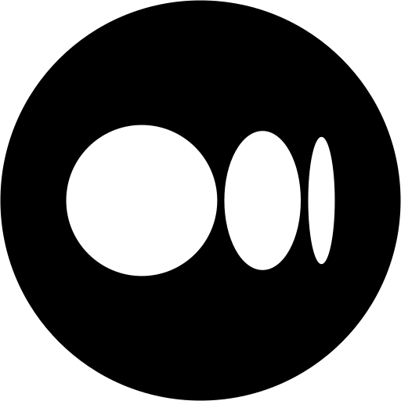

<!-- Initially made with: https://rahuldkjain.github.io/gh-profile-readme-generator/ -->

<h1 align="center">Hi 👋, I'm Davide Passafaro</h1>
<h3 align="center">A passionate frontend developer from Italy</h3>

- 🔭 I’m currently working on **ConTe.it**
- 🌱 I’m currently learning **Nx and React**
- 💬 Ask me about **Angular, Ionic, Stencil.js, RxJs and NgRx**
- 📫 How to reach me **davide.passafaro@gmail.com**

<h3 align="left">Connect with me:</h3>

  
  
  

<h4 align="left">Languages:</h4>
  
  
  
  

  <h4 align="left">Frameworks and main tools:</h4>
  
  
  
  &nbsp;&nbsp;&nbsp;&nbsp;
  
  &nbsp;&nbsp;&nbsp;&nbsp;
  
  
  <h4 align="left">Tools & Libraries:</h4>
  
  &nbsp;&nbsp;&nbsp;&nbsp;
  
  &nbsp;&nbsp;&nbsp;&nbsp;
  
  
  &nbsp;&nbsp;&nbsp;&nbsp;
  
  
  &nbsp;&nbsp;&nbsp;&nbsp;
  
  
  
  <h4 align="left">Other:</h4>
  
  &nbsp;&nbsp;&nbsp;&nbsp;
  

  

  &nbsp;
  

