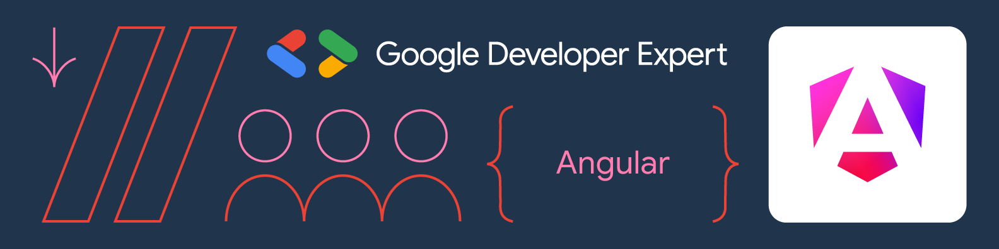
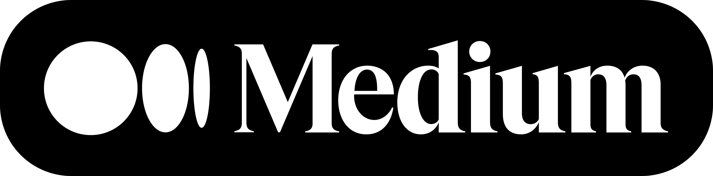
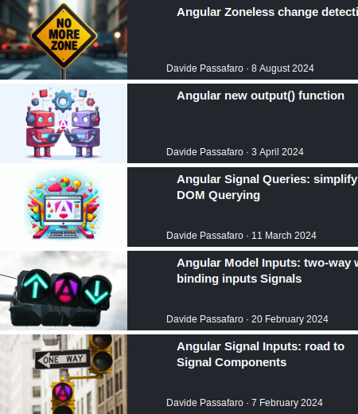
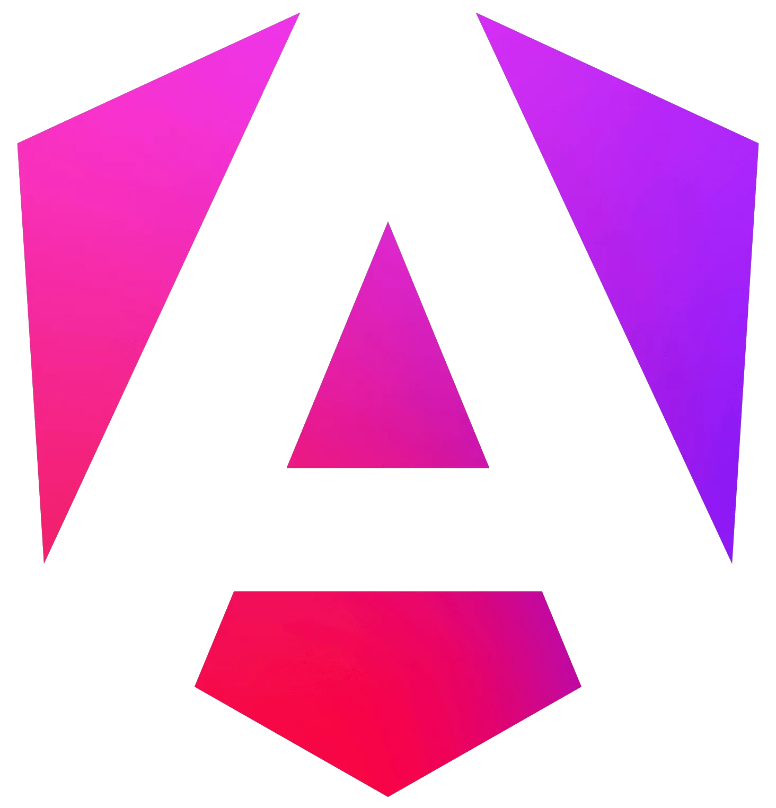
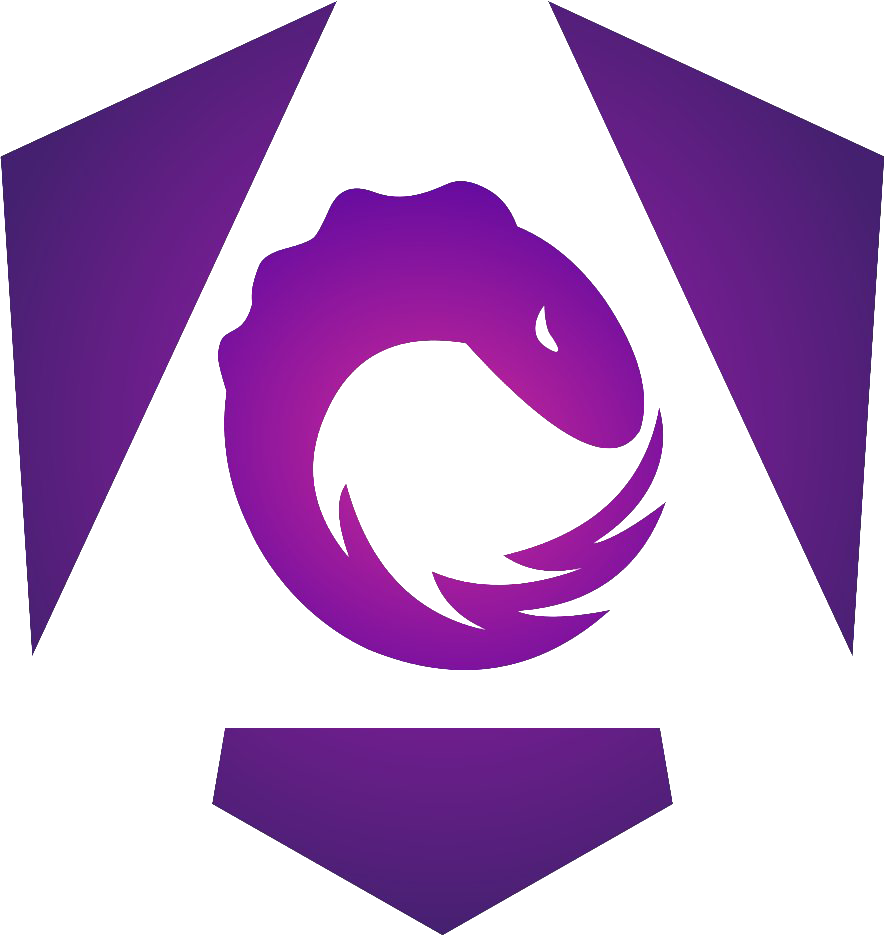
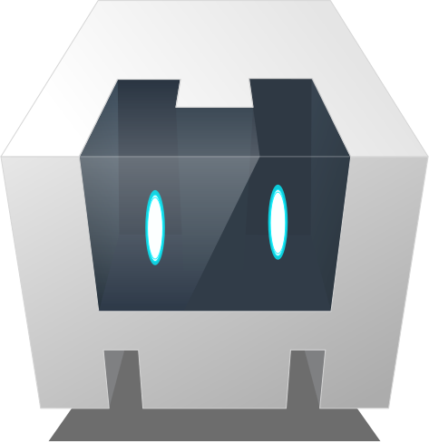

  
## Hi, I'm Davide Passafaro, nice to meet you 👋

I'm a Google Developer Expert in Angular and a Senior Frontend Engineer. 
I lead two developer communities in Rome: GDG Roma Città and Angular Roma. 
I am passionate about contributing to the tech community as a writer and speaker.

I have experience in mobile and desktop app development using Capacitor and Electron. 
I’ve also built high-performing applications leveraging technologies like Nx and NgRx.

I'm currently studying Node.js and React, in order to expand my knowledge and skills.

Outside of work, I love playing board games, practicing archery, and solving escape rooms.

### Connect with me:

&nbsp;&nbsp;&nbsp;&nbsp;

<!--  -->

<!-- ### Read my latest Medium articles: -->

<!--  -->

<!--  -->

---

### Main technologies I work with:

&nbsp;&nbsp;&nbsp;&nbsp;

&nbsp;&nbsp;&nbsp;&nbsp;

&nbsp;&nbsp;&nbsp;&nbsp;

### Currently exploring more:

&nbsp;&nbsp;&nbsp;&nbsp;

### Other technologies I worked with:

&nbsp;&nbsp;&nbsp;&nbsp;

&nbsp;&nbsp;&nbsp;&nbsp;

&nbsp;&nbsp;&nbsp;&nbsp;

---

