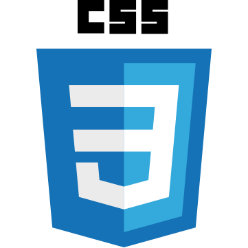
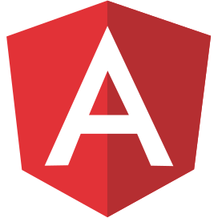
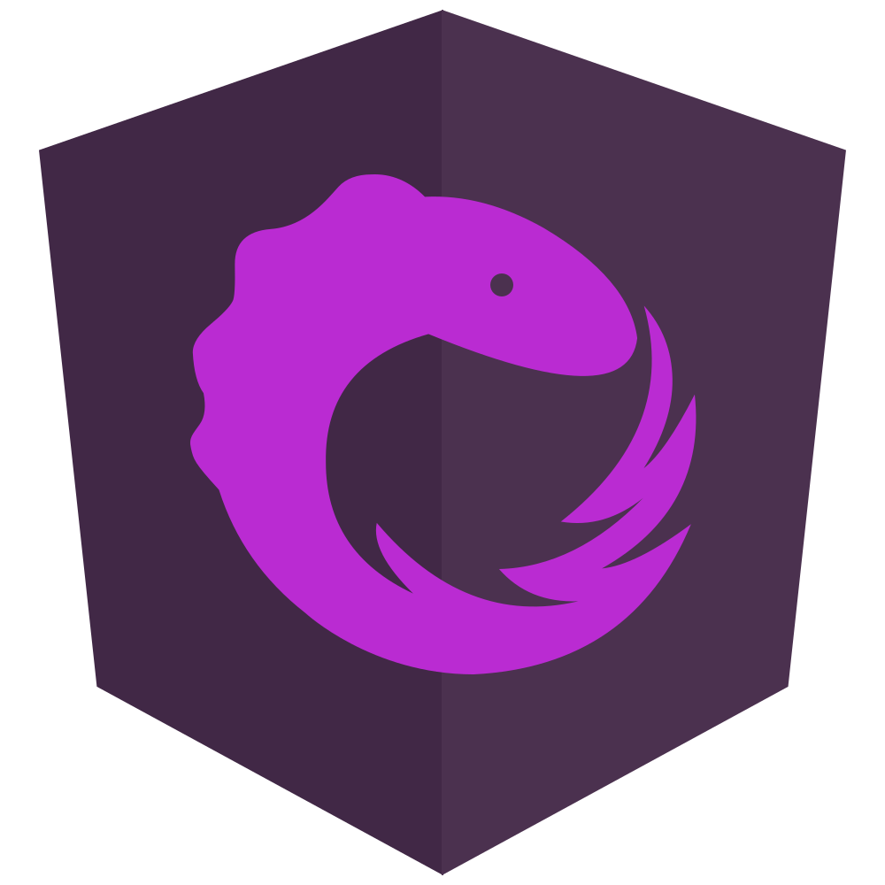
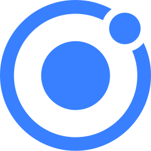
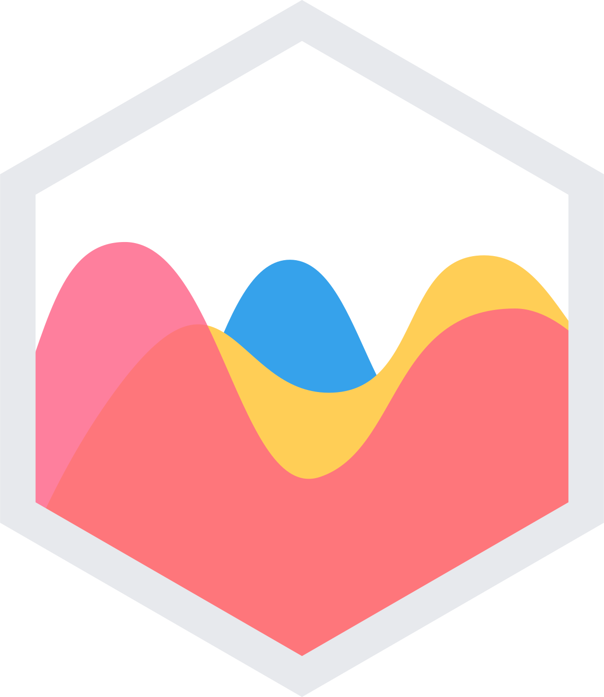
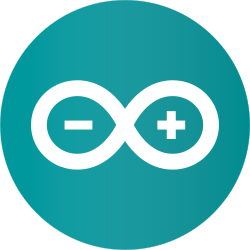
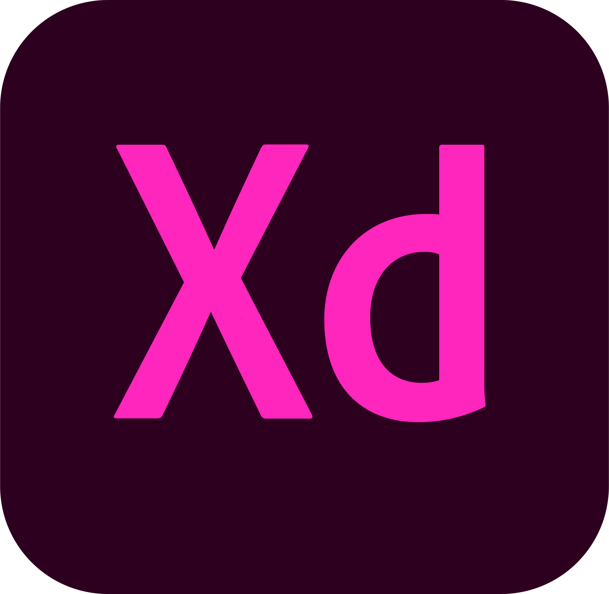

<!-- Initially made with: https://rahuldkjain.github.io/gh-profile-readme-generator/ -->

<h1 align="center">Hi 👋, I'm Davide Passafaro</h1>
<h3 align="center">A passionate frontend developer from Italy and a speaker of Angular Rome community</h3>

 

- 🔭 I’m currently working on **ConTe.it**
- 🌱 I’m currently learning **Nx and React**
- 💬 Ask me about **Angular, Ionic, Stencil.js, RxJs and NgRx**
- 📫 How to reach me **davide.passafaro@gmail.com**

### Connect with me:

***

#### Languages, frameworks and tools:

&nbsp;&nbsp;&nbsp;&nbsp;

&nbsp;&nbsp;&nbsp;&nbsp;

&nbsp;&nbsp;&nbsp;&nbsp;

#### Tools & Libraries:

&nbsp;&nbsp;&nbsp;&nbsp;

&nbsp;&nbsp;&nbsp;&nbsp;

&nbsp;&nbsp;&nbsp;&nbsp;

&nbsp;&nbsp;&nbsp;&nbsp;

#### Other:

&nbsp;&nbsp;&nbsp;&nbsp;

***

#### GitHub stats:

  
  

