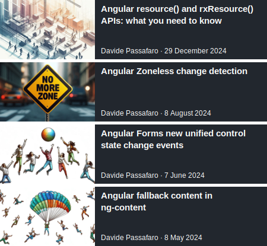
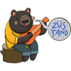

  
## Hi, I'm Davide Passafaro, nice to meet you 👋

As a Senior Frontend Engineer, I lead two developer communities in Rome: GDG Roma Città and Angular Roma. 
I am passionate about contributing to the tech community as a writer and speaker.

Specializing in Angular, I also have extensive experience in mobile and desktop app development using Capacitor and Electron. 
Over the years, I’ve built high-performing applications leveraging technologies like Nx, NgRx, and NGXS.  

Outside of work, I love playing board games or practicing archery. I’m also a fan of escape rooms and enjoy creating funny memes.

### Connect with me:

&nbsp;&nbsp;&nbsp;&nbsp;

<!--  -->

### Read my latest Medium articles:

<!--  -->

### My conference sessions in 2025:

&nbsp;&nbsp;&nbsp;&nbsp;

&nbsp;&nbsp;&nbsp;&nbsp;

&nbsp;&nbsp;&nbsp;&nbsp;

&nbsp;&nbsp;&nbsp;&nbsp;

&nbsp;&nbsp;&nbsp;&nbsp;

&nbsp;&nbsp;&nbsp;&nbsp;

&nbsp;&nbsp;&nbsp;&nbsp;

&nbsp;&nbsp;&nbsp;&nbsp;

&nbsp;&nbsp;&nbsp;&nbsp;

&nbsp;&nbsp;&nbsp;&nbsp;

---

### Languages, frameworks and tools I work with:

&nbsp;&nbsp;&nbsp;&nbsp;

&nbsp;&nbsp;&nbsp;&nbsp;

&nbsp;&nbsp;&nbsp;&nbsp;

### Other technologies I worked with:

&nbsp;&nbsp;&nbsp;&nbsp;

&nbsp;&nbsp;&nbsp;&nbsp;

&nbsp;&nbsp;&nbsp;&nbsp;

&nbsp;&nbsp;&nbsp;&nbsp;

---

### GitHub stats:

| My Github Stats                                                                                                                    | Most Used Languages                                                                                                                                          |
| ---------------------------------------------------------------------------------------------------------------------------------- | ------------------------------------------------------------------------------------------------------------------------------------------------------------ |
|  |  |

